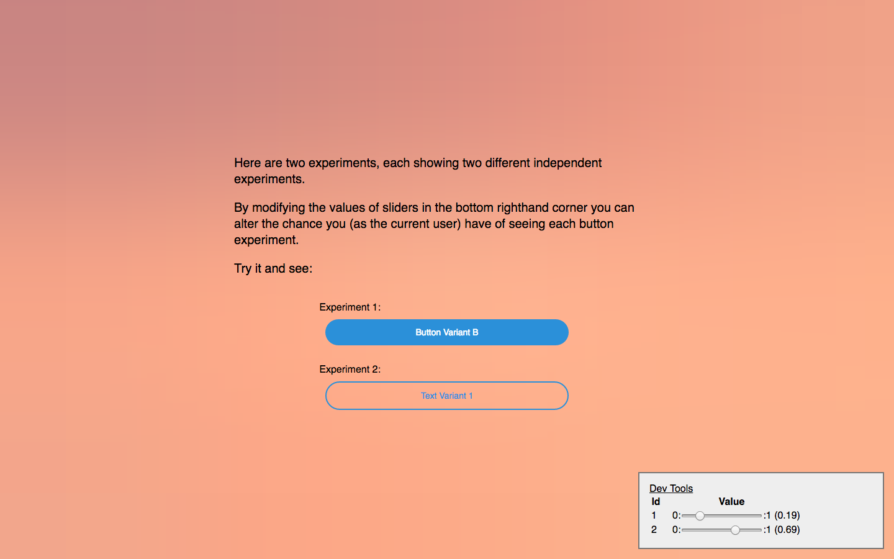

### Button Example Setup
```bash
$ git clone https://github.com/jackmccloy/alphabeta
$ cd alphabeta
$ npm install
$ cd examples/button-experiment
$ npm install
$ npm run start
$ open http://localhost:3000
```

### Now what?

If everything is working correctly, you should see two buttons on a coral-colored background. You should also see a grey "DevTools" box in the lower righthand corner. If this isn't what you see, make sure your API endpoint is properly set up before proceeding.



### So what am I looking at?

**Passing your variants to AlphaBeta**

Each button represents a test - _Test 1_ and _Test 2_. Take a moment to look at how these tests are defined in [examples/button-experiment/src/index.js](/examples/button-experiment/src/index.js). They're pretty similar, but there are a few important differences. 

In _Test 1_, the two variant component (variants) are passed to the AlphaBeta component as instances. In _Test 2_, they are passed as component elements. Also, in _Test 2_, the same component is used for both variants - the difference is that the _text_ prop passed to each variant is different.

So when should you use the _Test 1_ pattern and when should you use the _Test 2_ pattern? If you are passing props from your parent component down to your variants - or if what you're testing is a prop, as is the case in _Test 2_ here, you'll need to follow the pattern _Test 2_ uses. Otherwise, either pattern will work equally well.

**Setting up your experiment using experimentParams**

In addition to the two variants you pass to AlphaBeta, you also need to pass your experimentParams. experimentParams is an object with two keys - _id_ and _testCohortSize_. Let's take a look at what each does:

  * **_id_**: Each of your experiments must have a unique _id_. The _id_ will be sent to the AlphaBeta endpoint you set up, and will be used by your back end to uniquely identify this test and record it's data.

  If you haven't set up set up the endpoint that AlphaBeta will consume yet, follow the steps outlined in [#backend--api-setup](https://github.com/react-alpha-beta/alphabeta#backend--api-setup) and do that first - Otherwise AlphaBeta won't work!.

  * **_testCohortSize_**: Your _testCohortSize_ parameter should be a number between 0.0 and 1.00, and it represents what proportion of your users will see the B variant of your test. So if you set _testCohortSize_ to 0.1, 90% of your users will see ComponentA and the other 10% will see ComponentB. If you set _testCohortSize_ to 0.5, half of your users will see each variant.

**What about that DevTools box in the corner?**
In the lower right corner of your screen, you should see a DevTools box. This box lets you control your user cohort value for each of the experiments on the page. Recall that the user cohort value for an experiment, along with the _testCohortSize_ parameter, determine which variant a user sees.

If the user cohort value is greater than or equal to _testCohortSize_, the user will see variant A for this experiment. If the user cohort value is less than _testCohortSize_, the user will see variant B. Try moving your DevTools sliders all the way to the left. When you refresh the page, you'll notice that you're seeing Variant B for both experiments. If you move your sliders to the right and refresh, you'll see Variant A.
